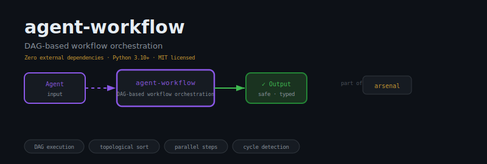
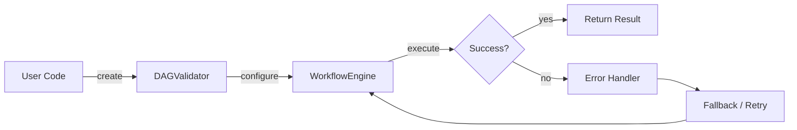
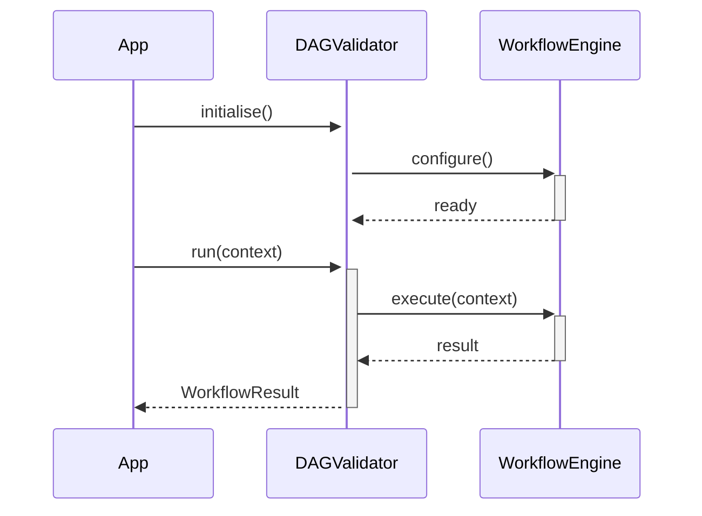

<div align="center">

</div>

# agent-workflow

**Multi-step workflow orchestration for LLM agents**

[](https://pypi.org/project/agent-workflow/) [](https://python.org) [](LICENSE) [](#)

---

## The Problem

Without orchestration, multi-step agent pipelines degenerate into tangled callback chains — steps run out of order, failed tasks block downstream work silently, and retrying a half-completed run means starting from scratch. Debugging becomes archaeology.

## Installation

```bash
pip install agent-workflow
```

## Quick Start

```python
from agent_workflow import DAGValidator, WorkflowEngine, WorkflowResult

# Initialise
instance = DAGValidator(name="my_agent")

# Use
result = instance.run()
print(result)
```

## API Reference

### `DAGValidator`

```python
class DAGValidator:
    """Validates and sorts a directed acyclic graph of tasks.
    def has_cycle(tasks: dict) -> bool:
        """Return ``True`` if the dependency graph contains a cycle.
```

### `WorkflowEngine`

```python
class WorkflowEngine:
    """Executes a Workflow, respecting dependencies and conditions."""
    def __init__(self, workflow: Workflow) -> None:
    def run(self, context: dict | None = None) -> WorkflowResult:
        """Execute the full workflow and return a WorkflowResult."""
```

### `WorkflowResult`

```python
class WorkflowResult:
    """Immutable record of a completed workflow run."""
    def to_dict(self) -> dict:
    def __repr__(self) -> str:
```


## How It Works

### Flow



### Sequence



## Philosophy

> Like the *karma-yoga* of the Gita — act without attachment to outcome; each step performs its duty and passes the torch.

---

*Part of the [arsenal](https://github.com/darshjme/arsenal) — production stack for LLM agents.*

*Built by [Darshankumar Joshi](https://github.com/darshjme), Gujarat, India.*
