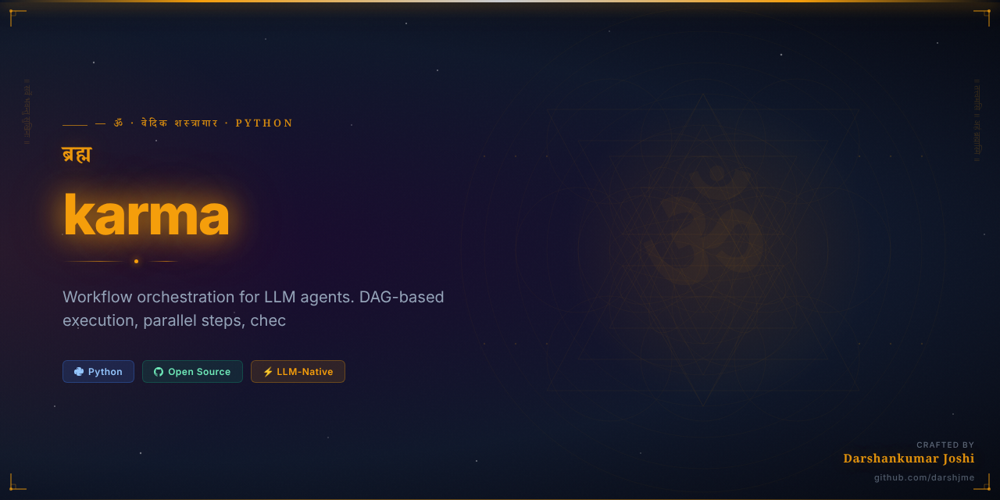
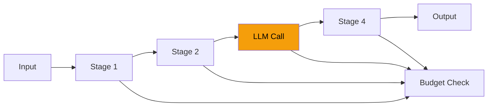

<div align="center">



# ⚡ कर्म
## `karma`

> *Bhagavad Gita 3.5 — Karma Yoga*

### Sacred Action — the central law of Gita

**Workflow orchestration for LLM agents. DAG-based execution, parallel steps, checkpointing.**

[](https://python.org)
[](https://github.com/darshjme/karma)
[](https://github.com/darshjme/arsenal)
[](LICENSE)

*Formerly `agent-workflow` — Part of the [**Vedic Arsenal**](https://github.com/darshjme/arsenal): 100 production-grade Python libraries for LLM agents, each named from the Vedas, Puranas, and Mahakavyas.*

</div>

---

## The Vedic Principle

*"Karmanye vadhikaraste ma phaleshu kadachana"* — Your right is to action alone, never to the fruits of action. — Bhagavad Gita 2.47

This is the central law of existence, and it is the central principle of `karma` — the workflow engine.

Each stage in the workflow has its dharma: its specific action, its specific responsibility. The pipeline does not concern itself with final outcomes — it executes each step with perfection and passes the result to the next stage. Budget enforcement, retry hooks, observability — all built into the sacred workflow of action, not outcome.

---

## How It Works



---

## Installation

```bash
pip install karma
```

Or from source:
```bash
git clone https://github.com/darshjme/karma.git
cd karma && pip install -e .
```

## Quick Start

```python
from karma import *

# See examples/ for full usage
```

---

## The Vedic Arsenal

`karma` is one of 100 libraries in **[darshjme/arsenal](https://github.com/darshjme/arsenal)** — each named from sacred Indian literature:

| Sanskrit Name | Source | Technical Function |
|---|---|---|
| `karma` | Bhagavad Gita 3.5 — Karma Yoga | Sacred Action — the central law of Gita |

Each library solves one problem. Zero external dependencies. Pure Python 3.8+.

---

## Contributing

1. Fork the repo
2. Create feature branch (`git checkout -b fix/your-fix`)  
3. Add tests — zero dependencies only
4. Open a PR

---

<div align="center">

**⚡ Built by [Darshankumar Joshi](https://github.com/darshjme)** · [@thedarshanjoshi](https://twitter.com/thedarshanjoshi)

*"कर्मण्येवाधिकारस्ते मा फलेषु कदाचन"*
*Your right is to action alone, never to its fruits. — Bhagavad Gita 2.47*

[Vedic Arsenal](https://github.com/darshjme/arsenal) · [GitHub](https://github.com/darshjme) · [Twitter](https://twitter.com/thedarshanjoshi)

</div>
